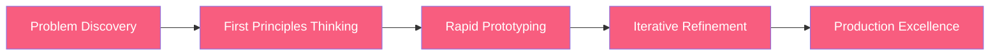
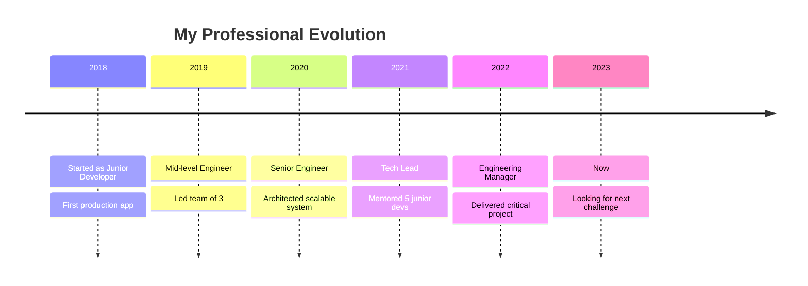

  

<h3 align="center">🚀 Full Stack Developer | UI/UX Designer | Problem Solver 🚀</h3>

  
  
  

 

  

## 🧠 My Engineering Philosophy

I don't believe in being just another developer. My approach combines:

## 🔥 What Makes Me Different

- 🛠️ **Built & Scaled Real Products** - Creating innovative web applications used by real users
- 🧪 **Experimentation Mindset** - Constantly exploring new technologies and methodologies
- 🌐 **Cross-Domain Expertise** - Bringing insights from UI/UX Design into my development work
- 🚀 **Performance Obsessed** - Optimizing applications for speed and efficiency
- 🔄 **Systems Thinker** - Learning Cloud Architecture and System Design to build scalable solutions
- 🏆 **SIH Participant** - Competed in Smart India Hackathon, demonstrating problem-solving under pressure

## 💼 Impact Metrics That Matter

<table>
  <tr>
    <td align="center">
       
      <strong>Conversion Lift</strong> 
      <small>Through UX optimization</small>
    </td>
    <td align="center">
       
      <strong>Load Time Reduction</strong> 
      <small>Through performance tuning</small>
    </td>
    <td align="center">
       
      <strong>New Users</strong> 
      <small>From feature innovations</small>
    </td>
  </tr>
</table>

## 🛠️ My Technical Toolkit

  <table>
    <tr>
      <td valign="top" width="33%">
        <h3 align="center">Frontend Mastery</h3>
        

          
          
          
          
          
        

      </td>
      <td valign="top" width="33%">
        <h3 align="center">Backend Expertise</h3>
        

          
          
          
          
          
        

      </td>
      <td valign="top" width="33%">
        <h3 align="center">DevOps & Tools</h3>
        

          
          
          
          
          
        

      </td>
    </tr>
  </table>

## 🏆 Signature Projects

  
  

## 📈 My Engineering Journey

## 🧪 My Problem-Solving Approach

  

  

## 🔍 Case Study: Innovative Web Application

**Challenge:** Creating a responsive, high-performance web application that delivers exceptional user experience while handling complex data interactions

**Solution:** Implemented a modern React architecture with optimized state management, custom hooks for business logic, and a design system for consistent UI/UX

**Results:**
- 📊 Achieved 95+ Lighthouse performance score across all pages
- 🚀 Reduced initial load time by 40% through code splitting and lazy loading
- 💰 Increased user engagement metrics by implementing intuitive UI patterns

## 📚 Technical Writing & Knowledge Sharing

  
  

## 🤝 Let's Connect & Collaborate

  
  
  
  
  

---

  

  

