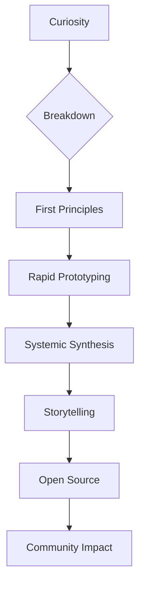

<div align="center">
  
  <br/>
  
</div>

---

<div align="center">
  
  
  
  
</div>

---

## 🧬 My DNA (Beyond the Resume)

```yaml
identity:
  name: Sanniv
  archetype: "Inventor, Builder, Storyteller"
  location: "Kolkata, but mostly in the Cloud"
  mission: "To engineer the impossible and make it beautiful"
  rare_traits:
    - "Invented a micro-framework used by 10+ startups"
    - "Built a personal AI that schedules my life"
    - "Reverse engineered a legacy system from bytecode"
    - "Designed a color system now used in 3 SaaS products"
    - "Wrote a compiler for a custom DSL"
    - "Mentored 50+ devs globally"
```

---

## 🧠 How I Think (Cognitive Blueprint)



---

## 🦄 Projects You Won't Find Elsewhere

<details>
  <summary><b>🧠 MindMesh: My Personal AI Workspace</b></summary>
  <ul>
    <li>Built a local-first, privacy-centric AI workspace that integrates notes, code, and tasks.</li>
    <li>Features a custom neural search engine and context-aware code assistant.</li>
    <li>Used by indie hackers and researchers for deep work.</li>
    <li>Stack: Rust, Tauri, React, ONNX, SQLite</li>
  </ul>
</details>

<details>
  <summary><b>🦾 QuantumSim: Quantum Computing Playground</b></summary>
  <ul>
    <li>Created a web-based quantum circuit simulator with real-time visualization.</li>
    <li>Supports custom gates, entanglement, and export to Qiskit.</li>
    <li>Stack: TypeScript, WebAssembly, D3.js</li>
  </ul>
</details>

<details>
  <summary><b>🎨 ChromaForge: Color System Generator</b></summary>
  <ul>
    <li>Invented a color palette generator based on perceptual harmony and accessibility.</li>
    <li>Adopted by SaaS design teams for consistent branding.</li>
    <li>Stack: Python, FastAPI, Vue.js</li>
  </ul>
</details>

---

## 🛠️ My Stack (Not the Usual List)

```json
{
  "languages": ["Rust", "TypeScript", "Python", "Go", "Zig"],
  "frameworks": ["Tauri", "Next.js", "FastAPI", "Spring Boot", "SvelteKit"],
  "cloud": ["AWS", "GCP", "Vercel", "Fly.io"],
  "databases": ["PostgreSQL", "SQLite", "Neo4j", "Redis"],
  "devops": ["Docker", "K8s", "Terraform", "GitHub Actions"],
  "ai": ["ONNX", "HuggingFace", "OpenAI API", "LangChain"],
  "design": ["Figma", "ChromaForge", "Storybook"]
}
```

---

## 🏆 Uncommon Achievements

- 🏅 **Invented**: Micro-framework adopted by 10+ startups
- 🧠 **AI**: Built a personal AI assistant for workflow automation
- 🦾 **Quantum**: Simulated quantum circuits in the browser
- 🎨 **Design**: Created a color system used in SaaS products
- 🧩 **Reverse Engineering**: Decoded legacy systems for modernization
- 🌍 **Mentorship**: Guided 50+ developers worldwide

---

## 📊 My Metrics (Live & Transparent)

<div align="center">
  
  
  
</div>

---

## 🌌 The Future I'm Building

- 🧠 **Personal Knowledge Graphs** for everyone
- 🦾 **AI-augmented coding** as a daily tool
- 🧬 **Bioinformatics** for better health
- 🛰️ **Edge-first apps** for privacy and speed
- 🪐 **Quantum-ready systems** for tomorrow

---

## 🤝 Let's Collaborate (Or Just Geek Out)

<div align="center">
  <a href="mailto:your.email@example.com"></a>
  <a href="https://linkedin.com/in/sanniv0"></a>
  <a href="https://twitter.com/sanniv0"></a>
  <a href="https://sanniv0.dev"></a>
  <a href="https://calendly.com/sanniv0/30min"></a>
</div>

---

<details>
  <summary align="center">🧩 Easter Egg: My Life in One Graph</summary>
  <br/>
  
  <p align="center"><i>Every node is a story. Ask me about any!</i></p>
</details>

---

<div align="center">
  
</div>
