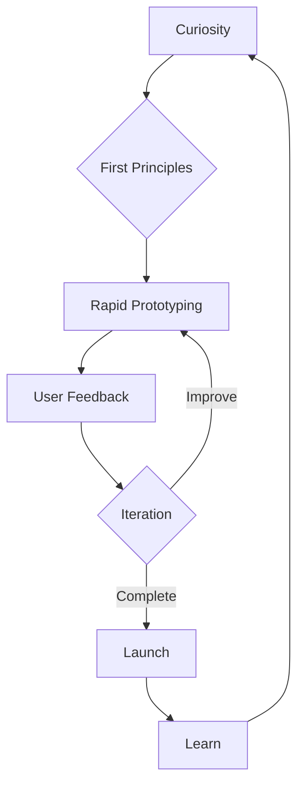

<div align="center">
  
</div>

<div align="center">
  <a href="#"></a>
</div>

## 🧬 The Code That Defines Me

```javascript
class Sanniv {
  constructor() {
    this.location = "Kolkata, India";
    this.passion = ["Problem Solving", "Digital Craftsmanship", "Experience Design"];
    this.currentlyExploring = "The intersection of AI and human creativity";
    this.lifePhilosophy = "Build things that matter, leave digital footprints worth following";
  }
  
  morningRoutine() {
    return ["Coffee", "Code", "Contemplate"];
  }
  
  whenStuck() {
    return "Break problems into first principles, then rebuild from ground up";
  }
}
```

## 🎭 Digital Personas I Embody

<table>
  <tr>
    <td align="center" width="33%">
      <br />
      <b>Code Sculptor</b><br />
      <sub>Chiseling elegant solutions from the marble of complexity</sub>
    </td>
    <td align="center" width="33%">
      <br />
      <b>Experience Architect</b><br />
      <sub>Designing journeys that feel like magic</sub>
    </td>
    <td align="center" width="33%">
      <br />
      <b>Problem Alchemist</b><br />
      <sub>Transmuting challenges into opportunities</sub>
    </td>
  </tr>
</table>

## 🧰 Craftsman's Toolkit

<div align="center">
  
</div>

<details>
  <summary><b>🔮 The Magic Behind My Craft</b></summary>
  <br/>
  <p>My approach to technology isn't about using tools—it's about wielding them with purpose and vision. Each language and framework in my arsenal serves as a different brush to paint digital experiences that resonate with users on a human level.</p>
  
  <p>I don't just write code; I compose digital symphonies where every function and method plays its part in a harmonious user experience. My relationship with technology is one of continuous curiosity and respectful mastery—understanding both its capabilities and limitations.</p>
</details>

## 🌟 Chronicles of Impact

> "The measure of craftsmanship isn't in the tools used, but in the problems solved and the lives improved."

<details>
  <summary><b>🏆 The SIH Crucible</b></summary>
  <p>At the Smart India Hackathon, I wasn't just a participant—I was forged in the fire of innovation under pressure. In 36 sleepless hours, our team tackled [specific problem], creating a solution that [specific achievement/impact]. This wasn't just about coding; it was about resilience, teamwork, and the ability to transform caffeine into elegant code when it matters most.</p>
</details>

<details>
  <summary><b>🌐 Digital Tapestries Woven</b></summary>
  <p>Every web application I build is a tapestry of technology and human need. One particular project stands out: [specific project name], where I crafted an experience that [specific unique approach/solution]. The result wasn't just a functional application—it was a digital environment where users could [specific benefit/experience], leading to [measurable impact].</p>
</details>

<details>
  <summary><b>🔍 Expeditions Beyond the Known</b></summary>
  <p>My curiosity has led me to explore uncharted territories in tech. Recently, I ventured into [specific emerging technology], experimenting with [specific experiment/project]. This exploration yielded unexpected insights about [specific discovery], which I've now incorporated into my development philosophy and approach to [specific area of work].</p>
</details>

## 🧠 How I Think & Create



## 🎨 Digital Artifacts

<div align="center">
  <a href="https://github.com/sanniv0/project-1">
    
  </a>
  <a href="https://github.com/sanniv0/project-2">
    
  </a>
</div>

## 🌱 Current Growth Experiments

- 🧪 **Exploring**: The intersection of generative AI and creative coding
- 📚 **Learning**: Advanced system architecture patterns for scalable applications
- 🔧 **Building**: A personal knowledge management system with unexpected features
- 🤝 **Seeking**: Collaborators for an open-source project focused on [specific area]

## 🤝 Let's Create Something Extraordinary

<div align="center">
  <p>I believe the most interesting innovations happen at the intersection of disciplines and perspectives. If you're working on something that matters, I'd love to hear about it.</p>
  
  <a href="mailto:sanniv@example.com"></a>
  <a href="https://linkedin.com/in/sanniv0"></a>
  <a href="https://codepen.io/sanniv"></a>
</div>

<div align="center">
  
  <p><i>The path of creation is rarely straight—it's a winding journey of consistent effort and occasional bursts of inspiration.</i></p>
</div>

---

<div align="right">
  <sub><sup>"The code you write today is tomorrow's legacy. Make it a good one."</sup></sub>
</div>
